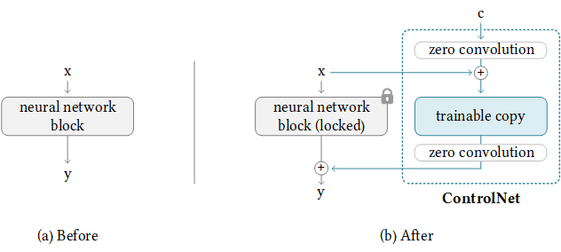

# ControlNet for Stable Diffusion XL

Modified from original repo of controlnet https://github.com/lllyasviel/ControlNet

ControlNet is a neural network structure to control diffusion models by adding extra conditions.

It copys the weights of neural network blocks into a "locked" copy and a "trainable" copy. (actually the UNet part in SD network)

The "trainable" one learns your condition. The "locked" one preserves your model. 

No constructure change has been made in controleNet

## Device Requirements
All params need to be trained is about 1.3B, and 2.6B params play role in loss backward, so you may need a GPU with at least 48GB device memory.

training has been tested on A40 48GB GPU

# Stable Diffusion + ControlNet

In stable diffusion 2.1 and 1.5 ,by repeating the above simple structure 13 times, we can control stable diffusion in this way:

In Stable diffusion XL, there are only 3 groups of Encoder blocks, so the above simple structure only need to be repeated 10 times

## First create a new conda environment

    conda env create -f environment.yaml
    conda activate control
warning: there are channels in environment.yaml(convenient for chinese user), and potorch 2.0.1 + cu118 cannot be installed in these channle, so you may need to install pytorch manually
## Convert safetensors to ckpt
    
    python safetensor2ckpt.py sd_xl_base_1.0.safetensors
    or any location you put the safetensors

## Generate SDXL + ControlNet

    python tool_add_controlXL.py ./models/sd_xl_base_1.0.ckpt ./models/control_sdxl_ini.ckpt

## Inference Example

    python sdxl_inference.py

inference example seems work correctly

