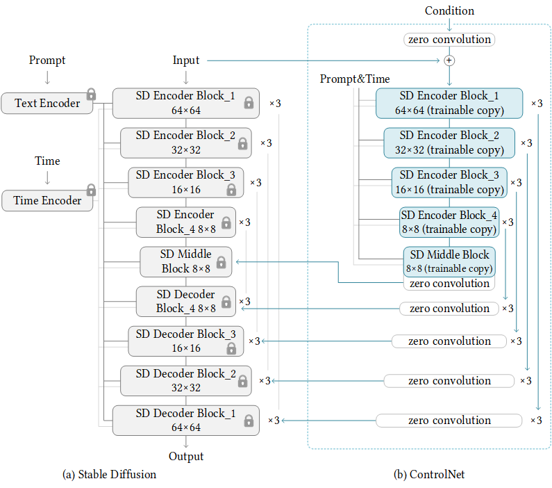

# ControlNet for Stable Diffusion XL

Modified from original repo of controlnet https://github.com/lllyasviel/ControlNet

ControlNet is a neural network structure to control diffusion models by adding extra conditions.

It copys the weights of neural network blocks into a "locked" copy and a "trainable" copy. (actually the UNet part in SD network)

The "trainable" one learns your condition. The "locked" one preserves your model. 

No constructure change has been made in controleNet

## Device Requirements
All params need to be trained is about 2.6B, so you may need a GPU with at least 32G memory.

It's not working on my RTX3090, I'm testing the training code on a A10

# Stable Diffusion + ControlNet

In stable diffusion 2.1 and 1.5 ,by repeating the above simple structure 13 times, we can control stable diffusion in this way:

In Stable diffusion XL, there are only 3 Encoder blocks, so  the above simple structure only need to be repeated 10 times

## First create a new conda environment

    conda env create -f environment.yaml
    conda activate control

## Convert safetensors to ckpt
    
    python safetensor2ckpt.py sd_xl_base_1.0.safetensors
    or any location you put the safetensors

## Generate SDXL + ControlNet

    python tool_add_controlnet.py --model sd_xl --controlnet --output sd_xl_controlnet

## Inference Example

    python sdxl_inference.py --model sd_xl_controlnet --input input.png --output output.png

inference example seems work correctly

